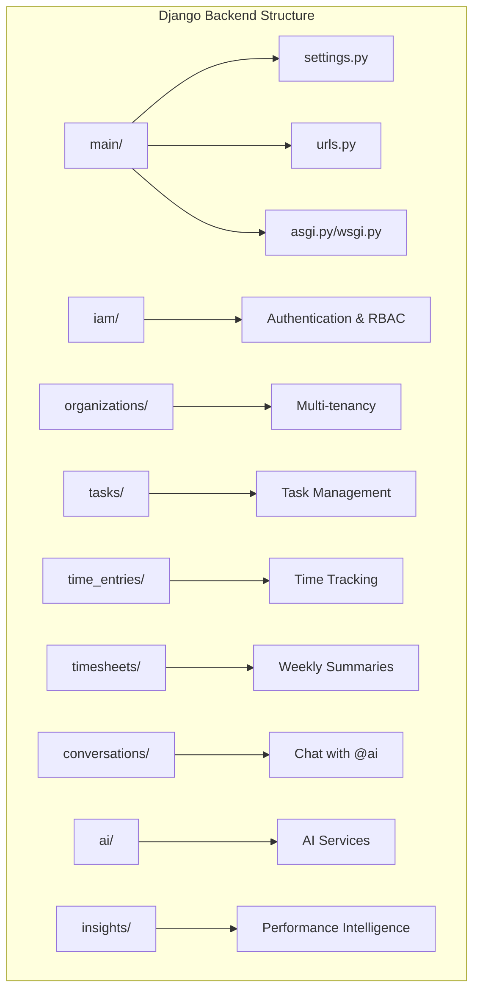
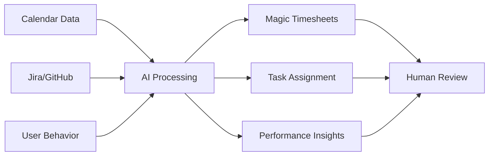
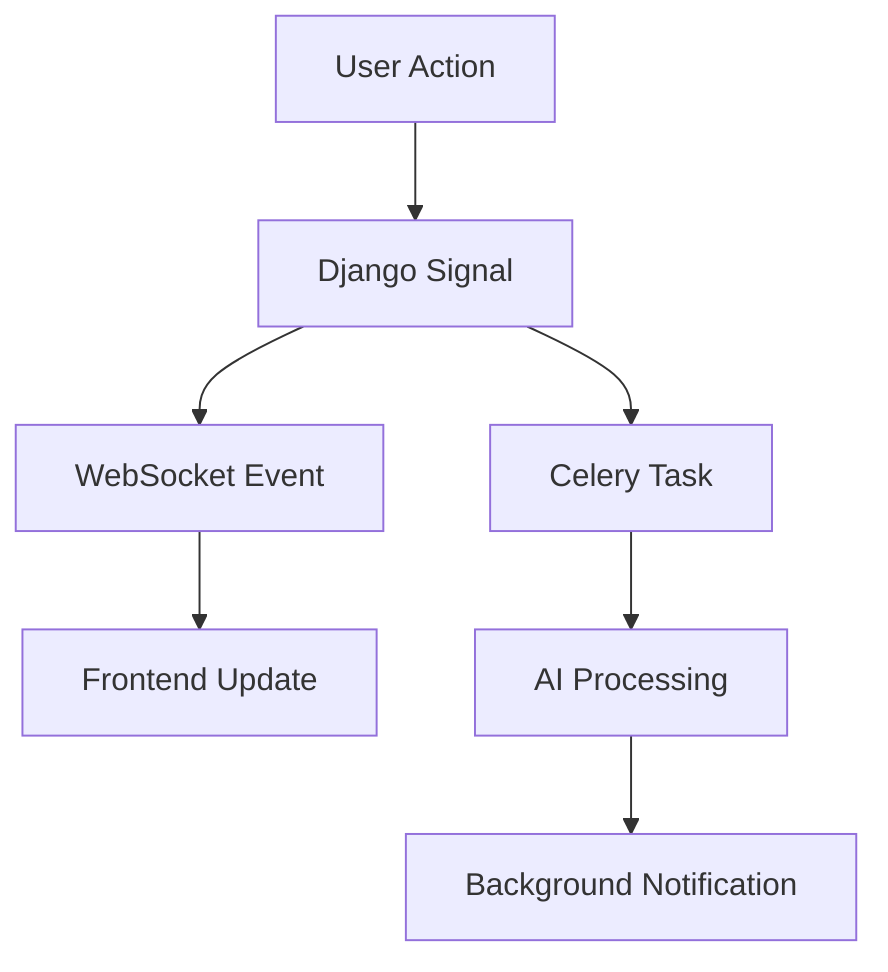

# NovaTime Implementation Plan Design Review

## Overview

This design review evaluates the NovaTime implementation plan against the requirements specified in the initial business plan. NovaTime aims to be a unified, AI-first platform for time tracking, task management, performance intelligence, and team collaboration with strong privacy controls.

## Architecture Assessment

### 1. Repository Type Classification

Based on the analysis, NovaTime is clearly a **Full-Stack Application** with:
- Django backend with RESTful APIs
- React frontend with modern tooling (TypeScript, Vite, Tailwind)
- Real-time communication via WebSockets/SSE
- AI integration components
- Multi-tenant SaaS architecture

This classification aligns perfectly with the documented structure and requirements.

### 2. Backend Architecture Evaluation

#### ✅ Strengths


The Django app structure demonstrates excellent separation of concerns:
- **Clean modularity**: Each feature domain has its own app
- **Scalability**: Apps can be extracted into microservices later
- **Django best practices**: Following standard conventions
- **Feature completeness**: All major requirements covered

#### ⚠️ Areas for Improvement

1. **Missing Integration Apps**: While `integrations/` is mentioned, specific apps for calendar, Jira, GitHub integration aren't visible
2. **AI Service Organization**: Need clearer breakdown of AI components
3. **Policy Engine**: Overtime/break policies may need dedicated app

### 3. Frontend Architecture Evaluation

#### 🔄 Technology Stack Revision

Based on project analysis, the frontend technology decisions need refinement:

**Build Tool Analysis: Vite vs Create React App**

The sample applications use **Vite** extensively, and here's why it's the superior choice:

```json
// Current sample using Vite
{
  "scripts": {
    "dev": "vite",
    "build": "vite build",
    "preview": "vite preview"
  },
  "devDependencies": {
    "vite": "5.2.0",
    "@vitejs/plugin-react": "4.2.1"
  }
}
```

**Vite Benefits for NovaTime:**
1. **Development Speed**: 
   - Hot Module Replacement (HMR) ~10x faster than Webpack
   - Cold start time <1s vs 3-5s with CRA
   - Critical for AI chat streaming features requiring rapid iteration

2. **Build Performance**:
   - Uses esbuild for transpilation (10-100x faster than Babel)
   - Tree-shaking optimization built-in
   - Essential for large time tracking dashboard builds

3. **Modern Standards**:
   - Native ES modules support
   - Better TypeScript integration
   - Future-proof for NovaTime's enterprise requirements

4. **Sample App Alignment**:
   - All AI chat samples use Vite successfully
   - Proven SSE/WebSocket integration patterns
   - Consistent tooling across codebase

**Recommendation**: ✅ **Keep Vite** - Performance benefits outweigh any learning curve

#### 🔄 UI Library Strategy: MUI Integration

Based on your feedback to use **MUI mainly**, here's the revised approach:

**MUI + Design Tokens Hybrid Strategy:**

```typescript
// MUI Theme with NovaTime design tokens
import { createTheme } from '@mui/material/styles';

const novaTimeTheme = createTheme({
  palette: {
    primary: {
      main: '#2563eb', // --primary from tokens
    },
    success: {
      main: '#22c55e', // --success
    },
    warning: {
      main: '#f59e0b', // --warning
    },
    error: {
      main: '#ef4444', // --error
    },
    // Custom NovaTime colors
    timeTracking: {
      main: '#10b981', // --time-tracking
    },
    taskPriority: {
      high: '#dc2626',
      medium: '#f59e0b',
      low: '#6b7280',
    }
  },
  typography: {
    fontFamily: '-apple-system, Segoe UI, Roboto, Inter, sans-serif',
  },
  components: {
    MuiButton: {
      styleOverrides: {
        root: {
          borderRadius: '10px', // --radius-md from tokens
          textTransform: 'none',
        },
      },
    },
  },
});
```

**MUI Components for NovaTime:**
- **Data Display**: `DataGrid` for timesheets, `Table` for reports
- **Navigation**: `Drawer` for sidebar, `AppBar` for header
- **Forms**: `TextField`, `Select`, `DatePicker` for time entries
- **Feedback**: `Dialog`, `Snackbar`, `LinearProgress`
- **Time Tracking**: Custom components built on MUI base

#### ✅ Design System Excellence with MUI

```css
/* Design tokens that complement MUI */
:root {
  /* Core NovaTime colors - mapped to MUI theme */
  --primary: #2563eb;
  --success: #22c55e;
  --warning: #f59e0b;
  --error: #ef4444;
  
  /* Time tracking specific tokens */
  --time-active: #10b981;
  --approval-pending: #f59e0b;
  --task-priority-high: #dc2626;
  
  /* MUI spacing alignment */
  --space-1: 8px;   /* MUI spacing(1) */
  --space-2: 16px;  /* MUI spacing(2) */
  --space-3: 24px;  /* MUI spacing(3) */
}
```

**Advantages of MUI + Design Tokens:**
- **Rapid Development**: Pre-built accessible components
- **Consistency**: MUI's design system + NovaTime customizations
- **Accessibility**: WCAG compliance built into MUI components
- **TypeScript**: Excellent type definitions
- **Theming**: Centralized theme management
- **Community**: Large ecosystem and support

#### 🔄 Component Architecture Alignment
The sample AI chat components provide strong patterns for NovaTime:
- **Message streaming**: SSE implementation for AI responses
- **Real-time updates**: WebSocket patterns for live collaboration
- **Accessible components**: ARIA labels and semantic HTML
- **Stop functionality**: User control over AI processes

## Feature Completeness Review

### 1. Core Features Mapping

| Initial Plan Requirement | Implementation Plan Coverage | Status |
|--------------------------|------------------------------|--------|
| Magic Timesheets (AI-generated) | ✅ AI service + time_entries integration | Complete |
| Performance Intelligence | ✅ insights/ app with analytics | Complete |
| Unified Workflow (timers + chat + PM) | ✅ Integrated apps architecture | Complete |
| Privacy-First Design | ✅ GDPR/CCPA compliance framework | Complete |
| Frontline Attendance | ✅ attendance/ app with kiosk | Complete |
| Multi-tenant Support | ✅ organizations/ app structure | Complete |
| Real-time Collaboration | ✅ conversations/ + WebSocket | Complete |
| Approval Workflows | ✅ approvals/ app | Complete |
| Billing & Invoicing | ✅ billing/ app with QBO/Xero | Complete |

### 2. AI Integration Assessment

#### ✅ Comprehensive AI Framework
The plan includes proper AI governance:
- **EU AI Act compliance**: Algorithm transparency
- **Bias testing**: Fairness validation procedures
- **Human oversight**: AI decision review processes
- **Explainable AI**: User-understandable insights

#### ✅ Technical Implementation


The AI workflow properly implements human-in-the-loop patterns.

## Implementation Phases Review

### Phase Structure Analysis

The 5-phase approach (20 weeks total) is well-structured:

#### Phase 1: Foundation (Weeks 1-4) ✅
- Authentication with OIDC/passkeys
- Basic CRUD operations
- Compliance framework setup
- Design system implementation

**Assessment**: Solid foundation with modern auth standards

#### Phase 2: Core Features (Weeks 5-8) ✅
- Timesheet management
- Project timelines
- Basic reporting
- Security implementation

**Assessment**: Covers essential business functionality

#### Phase 3: AI Integration (Weeks 9-12) ✅
- AI service integration
- Smart task assignment
- Performance insights
- AI governance framework

**Assessment**: Proper AI implementation with compliance

#### Phase 4: Advanced Features (Weeks 13-16) ✅
- Kiosk functionality
- External integrations
- Enterprise compliance
- Advanced analytics

**Assessment**: Complete feature set for enterprise readiness

#### Phase 5: Production Readiness (Weeks 17-20) ✅
- SEO marketing system
- Continuous compliance
- Performance optimization
- Security auditing

**Assessment**: Production-grade deployment preparation

## Compliance & Security Framework

### ✅ Comprehensive Standards Coverage

The implementation plan exceeds typical SaaS requirements:

#### Regulatory Compliance
- **GDPR/CCPA**: Complete data protection framework
- **SOC 2 Type II**: Security controls and audit procedures
- **ISO 27001**: Information security management
- **EU AI Act**: AI system compliance and transparency

#### Security Architecture
- **Zero Trust**: Never trust, always verify principles
- **Field-level Encryption**: PII protection
- **SIEM Integration**: Security monitoring
- **Audit Trails**: Comprehensive logging

#### Accessibility Standards
- **WCAG 2.2 AA**: Web accessibility compliance
- **Section 508**: Government requirements
- **Automated Testing**: Accessibility CI/CD integration

## Technical Decisions Review

### ✅ Excellent Technology Choices

1. **Django + DRF**: Mature, secure, rapid development
2. **React + TypeScript**: Type safety and modern UX
3. **Design Tokens**: Scalable design system approach
4. **WebSocket/SSE**: Real-time capabilities
5. **Docker**: Containerization for deployment
6. **PostgreSQL**: Robust relational database

### ✅ AI Integration Strategy

The plan correctly prioritizes:
- **Explainable AI**: Trust through transparency
- **Human oversight**: User control maintained
- **Privacy-first**: No surveillance approach
- **Bias testing**: Fairness validation

## Areas for Enhancement

### 1. Integration Architecture Detail

**Current State**: General mention of integrations
**Recommendation**: More specific integration app structure:

```
integrations/
├── calendar/          # Google Calendar, Outlook
├── issue_trackers/    # Jira, GitHub Issues
├── communication/     # Slack, Teams
├── version_control/   # GitHub, GitLab
└── payroll/          # QBO, Xero, ADP
```

### 2. AI Service Breakdown

**Current State**: Single `ai/` app
**Recommendation**: More granular AI services:

```
ai/
├── timesheet_generation/  # Magic timesheets
├── task_assignment/       # Smart assignment
├── performance_analysis/  # Insights
├── anomaly_detection/     # Issue identification
└── chat_assistant/        # @ai functionality
```

### 3. Real-time Architecture

**Current State**: Django Channels mentioned
**Recommendation**: Detailed real-time event system:



## Testing Strategy Evaluation

### ✅ Comprehensive Test Coverage

The plan includes:
- **Unit Tests**: Django TestCase + Jest
- **Integration Tests**: API testing with DRF
- **E2E Tests**: Playwright for user journeys
- **Accessibility Tests**: WCAG compliance automation

### 🔄 AI-Specific Testing Needs

Additional AI testing requirements:
- **Model Performance Tests**: Accuracy metrics
- **Bias Testing**: Fairness validation
- **Explainability Tests**: Output interpretability
- **Privacy Tests**: Data isolation verification

## Performance & Scalability

### ✅ Strong Performance Foundation

- **Database Optimization**: PostgreSQL with proper indexing
- **Caching Strategy**: Redis for session and data caching
- **CDN Integration**: Static asset delivery
- **Background Processing**: Celery for async tasks

### 🔄 AI Performance Considerations

**Recommendations**:
- **Model Caching**: Frequently accessed AI predictions
- **Batch Processing**: Efficient bulk AI operations
- **Response Streaming**: Real-time AI feedback
- **Fallback Mechanisms**: Graceful AI service degradation

## Mobile & Accessibility

### ✅ Mobile-First Approach

- **PWA Functionality**: Offline-capable web app
- **Responsive Design**: Mobile-optimized interface
- **Touch Interactions**: Mobile-friendly controls
- **Offline Queuing**: Network-resilient operations

### ✅ Accessibility Excellence

- **WCAG 2.2 AA**: Comprehensive compliance
- **Screen Reader Support**: Semantic HTML structure
- **Keyboard Navigation**: Full keyboard accessibility
- **Color Contrast**: High contrast design tokens

### ✅ Design System Evaluation

### ✅ MUI + Token-Based Architecture

The hybrid approach combining MUI with design tokens is optimal:

```typescript
// NovaTime-specific MUI theme extensions
const timeTrackingComponents = {
  MuiTimerCard: {
    styleOverrides: {
      root: {
        backgroundColor: 'var(--time-active)',
        '&.active': {
          boxShadow: '0 0 0 2px var(--primary)',
        },
      },
    },
  },
  MuiTaskCard: {
    variants: [
      {
        props: { priority: 'high' },
        style: {
          borderLeft: '4px solid var(--task-priority-high)',
        },
      },
    ],
  },
};

/* Motion system with accessibility */
@media (prefers-reduced-motion: reduce) {
  * {
    animation-duration: 0.01ms !important;
    transition-duration: 0.01ms !important;
  }
}
```

### ✅ Component Library Strategy

- **MUI Foundation**: Proven accessible components as base
- **Time Tracking Extensions**: Custom components for domain-specific needs
- **Design Token Integration**: CSS variables work seamlessly with MUI
- **TypeScript Support**: Full type safety with MUI's excellent types
- **Performance**: Tree-shaking ensures only used components are bundled

## Marketing & SEO Strategy

### ✅ Technical SEO Readiness

The plan includes comprehensive SEO implementation:
- **Next.js SSG/ISR**: Fast, indexable pages
- **Structured Data**: Schema.org markup
- **Core Web Vitals**: Performance optimization
- **Sitemap Automation**: Dynamic content indexing

### ✅ Content Strategy

- **Editorial Workflow**: AI-assisted content creation
- **Keyword Targeting**: Time tracking industry focus
- **Competitor Analysis**: Positioning against Clockify, Toggl
- **Measurement Framework**: SEO KPI tracking

## Risk Assessment

### ✅ Well-Identified Risks

The plan properly addresses:
- **AI Reliability**: Fallback mechanisms
- **Privacy Compliance**: GDPR/CCPA adherence
- **Scalability**: Performance monitoring
- **Security**: Comprehensive audit procedures

### 🔄 Additional Risk Considerations

**Data Migration Risk**: Plan should include:
- Migration from competitor tools
- Data validation procedures
- Rollback mechanisms
- User communication strategy

**AI Model Risk**: Consider:
- Model versioning strategy
- A/B testing for AI features
- Performance degradation monitoring
- Vendor lock-in mitigation

## Documentation Structure

### ✅ Comprehensive Documentation Framework

The `/docs/standards-compliance/` structure is excellent:
- **Technical Standards**: Development guidelines
- **Security Framework**: Audit and compliance
- **AI Governance**: Ethics and transparency
- **Accessibility**: WCAG compliance procedures

### 🔄 Developer Experience

**Recommendation**: Add developer-focused documentation:
- **API Documentation**: Interactive Swagger/OpenAPI
- **Component Library**: Storybook integration
- **Deployment Guides**: Environment-specific instructions
- **Troubleshooting**: Common issues and solutions

## Competitive Positioning

### ✅ Strong Differentiation Strategy

The plan correctly identifies key differentiators:
- **AI-First Approach**: Magic timesheets and smart assignment
- **Privacy Focus**: No surveillance, transparent controls
- **Unified Platform**: Desk + frontline in one tool
- **Explainable Insights**: Trust through transparency

### ✅ Market Positioning

- **Target Segments**: Agencies, field teams, product teams
- **Value Proposition**: "Time that fills itself"
- **Competitive Analysis**: Clear positioning vs. incumbents

## Final Recommendations

### 1. Immediate Actions (Week 1-2)

1. **Frontend Technology Setup**: 
   - Configure Vite with MUI integration
   - Set up design token system within MUI theme
   - Create NovaTime-specific MUI component extensions

2. **Refine Integration Architecture**: Detail specific integration apps
3. **AI Service Breakdown**: Create granular AI service structure
4. **Real-time Event System**: Design WebSocket event architecture
5. **Developer Documentation**: Set up Storybook with MUI components and API docs

### 2. Phase Adjustments

**Phase 1 Enhancement**: 
- Add integration app scaffolding
- Complete MUI + Vite + design token setup
- Establish component library foundation

**Phase 3 Expansion**: Include AI service breakdown
**Phase 4 Addition**: Advanced real-time features  
**Phase 5 Extension**: Developer experience improvements

### 3. Success Metrics Expansion

**Technical Metrics**:
- AI prediction accuracy (>85%)
- Real-time event latency (<200ms)
- Mobile performance (Lighthouse >90)
- Accessibility score (100% automated tests pass)

**Business Metrics**:
- Time entry accuracy improvement (>90%)
- Approval workflow efficiency (+50%)
- User adoption of AI features (>70%)
- Customer satisfaction (NPS >50)

## Conclusion

The NovaTime implementation plan demonstrates exceptional quality and comprehensive coverage of requirements. The architecture is well-designed, the technology choices are sound, and the compliance framework exceeds industry standards.

**Key Strengths**:
- ✅ Comprehensive feature coverage
- ✅ Modern technology stack (Vite + MUI + TypeScript)
- ✅ Hybrid design system approach (MUI + tokens)
- ✅ Strong compliance framework
- ✅ Well-structured development phases
- ✅ Privacy-first architecture
- ✅ Accessibility excellence through MUI

**Enhancement Opportunities**:
- 🔄 Complete MUI integration with design tokens
- 🔄 More detailed integration architecture
- 🔄 Granular AI service breakdown
- 🔄 Enhanced real-time event system
- 🔄 Expanded developer experience

**Technology Decision Summary**:
- ✅ **Vite**: Recommended for superior development experience and build performance
- ✅ **MUI**: Primary UI library with NovaTime design token customizations
- ✅ **TypeScript**: Enhanced with MUI's excellent type definitions
- ✅ **Design Tokens**: Integrated within MUI theme system for consistency

The implementation plan provides a solid foundation for building a market-leading time tracking platform that differentiates through AI capabilities while maintaining strong privacy and compliance standards.

Summary
The conversation focused on developing an implementation plan for the NovaTime platform, a unified AI-first time tracking and task management system. The discussion centered on two key technology decisions:
Frontend UI approach: Using Material-UI (MUI) as the primary component library while integrating custom design tokens for consistent theming
Build tool selection: Justifying the use of Vite over Create React App based on performance benefits for development speed and real-time features
The implementation plan was structured around a 5-phase approach covering 20 weeks:
Phase 1: Foundation and compliance framework setup
Phase 2: Core features and security implementation
Phase 3: AI integration and governance framework
Phase 4: Advanced features and compliance certification
Phase 5: Production readiness and continuous compliance
Key technical components identified include Django backend apps for various domains (identity, organizations, tasks, time tracking, attendance, etc.), React frontend with MUI components, real-time communication via WebSockets/SSE, and comprehensive AI services integration.The plan emphasized enterprise-grade compliance requirements including GDPR/CCPA, SOC 2 Type II, ISO 27001, and EU AI Act compliance with detailed documentation structure and implementation roadmap.
Verification
Review MUI + design tokens integration approach for component library architecture
Validate Vite performance benefits for AI chat streaming and real-time features
Confirm Django app structure aligns with multi-tenant SaaS requirements
Verify compliance framework covers all regulatory requirements (GDPR, SOC 2, ISO 27001)
Check that AI governance framework includes bias testing and explainable AI components
Ensure real-time communication patterns support WebSocket and SSE requirements
Validate that the 5-phase implementation approach covers all core NovaTime features
Confirm that frontend component architecture supports both desk and frontline worker needs