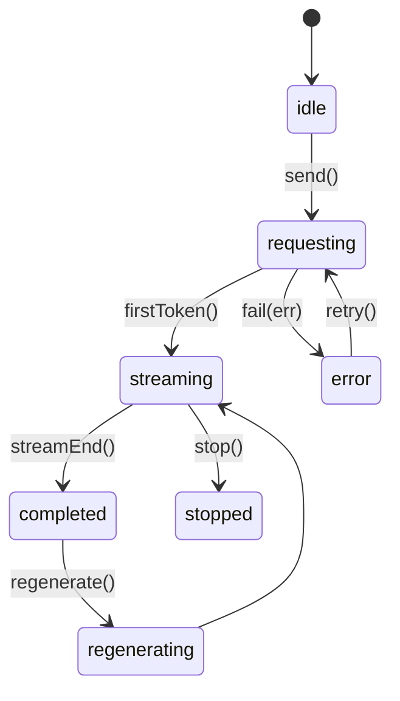
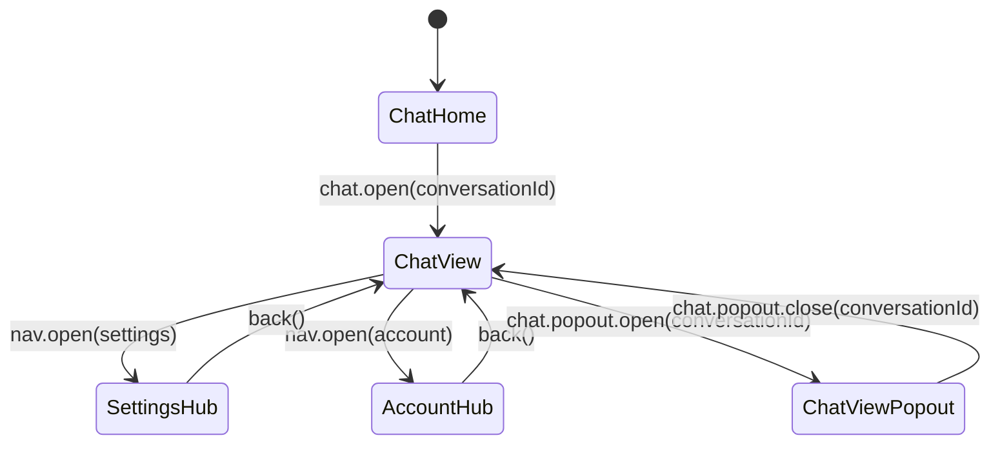

# AI Programming Assistant — Full Chat Interface Design Spec (v1.3)

**Owner:** Design Lead • **Approvers:** Product Lead, Frontend Lead, Accessibility Lead  
**Status:** Active • **Last Review:** 2025-08-27 • **Next Review:** 2025-11-27

---

## 1) Purpose & Scope
A standardized, **machine-readable** specification to reproduce an OpenAI-style programming assistant UI: **pre-login**, **post-login**, and **chat**. Includes behaviors, states, accessibility, mobile, testing, animations, pop-outs, and navigation.

---

## 2) Visual Language
### 2.1 Colors
- Primary `#1976d2`, Primary-pressed `#155a9f`
- Light BG `#f8f9fa`, Dark BG `#212529`
- User bubble (light) `#e8f1fb`, (dark) `#1f2a37`
- AI bubble (light) `#ffffff`, (dark) `#111827`
- Code (light) `#f5f5f5`, (dark) `#1e1e1e`
- Borders (light) rgba(0,0,0,.08), (dark) rgba(255,255,255,.12)
- Success `#2e7d32`, Warning `#ed6c02`, Error `#d32f2f`, Info `#0288d1`

### 2.2 Typography & Spacing
- Sans: -apple-system, Segoe UI, Roboto, Inter, sans-serif
- Mono: ui-monospace, Menlo, Consolas
- Sizes: h1 clamp(20px,2vw,28px), h2 clamp(18px,1.6vw,24px), body 16px, small 14px, code 13px
- Spacing grid: 8px base; cards 16px; bubbles 12px internal, 8px between
- Radius: 4,6,10,14,18,24 • Shadows: sm/md/lg
- Motion: fast 120ms, base 200ms, slow 320ms, curve cubic-bezier(0.2,0,0,1)

**Theme:** honors `prefers-color-scheme`; persist `ui.theme` and `ui.sidebarCollapsed` in localStorage.

---

## 3) Information Architecture
- **Pre-Login:** Sign in • Sign up • Reset
- **Post-Login:** Profile • Security/MFA • Social • Sessions/Devices • Billing • Danger Zone
- **Chat:** Sidebar (conversations, pinned, search) • Chat Pane (messages) • Composer • Optional Right Rail

---

## 4) User Journeys
- **New User:** Sign up → Verify → Complete Profile → Chat
- **Recovery:** Failed login → Reset → Success
- **Security Upgrade:** Prompt MFA after sensitive action
- **Programming Loop:** Ask → Code → Regenerate/Compare → Copy/Insert → Iterate

---

## 5) Components & Behaviors

### 5.1 Sidebar
- **Header:** logo + ☰ collapse (persists)
- **New Chat (+)**, **Search**, **Pinned**, **Recent**
- **Utilities:** My Settings • Account • Keyboard Shortcuts • What’s New • Help & Feedback
- **Collapsed:** icons+tooltips only; context menu per thread (Rename, Pin, Archive, Delete)

### 5.2 Chat Pane
- **User bubble:** right-aligned
- **AI bubble:** left-aligned
- **Code blocks:** collapsible, syntax, copy, optional “Insert to Editor”
- **Message actions (assistant):** Edit Prompt • Regenerate (tabs V1..Vn) • Feedback 👍👎 (+note) • Copy • Delete • Insert to Editor

### 5.3 Composer
- Auto-growing textarea
- Buttons: Send ▶, Attach 📎, Code Mode <>, Stop ■ (during streaming)
- Shortcuts: Ctrl/Cmd+Enter send • ↑ recall last prompt • Esc blur

### 5.4 Header
- Editable Conversation Title, Model Selector, Export/Share ⇪, Help ❔

### 5.5 Right Rail (optional)
- Citations, run details/logs, variables, session settings; uses side-drawer pattern

---

## 6) Message & Scroll Behavior
- **Streaming:** token-by-token; spinner until first token; Stop ■ cuts stream (state = stopped)
- **Auto-follow:** default; pauses when user scrolls up
- **Scroll-to-bottom FAB ↓:** appears when not at bottom (>120px), hides at bottom
- **Infinite scroll up:** loads older messages

---

## 7) Accessibility (WCAG 2.2 AA)
- Landmarks: header, nav, main, aside, footer; chat log uses `role="log"` + `aria-live="polite"` (append-only)
- Headings: one h1 per view (conversation title)
- Focus: visible ring; trap in modals/drawers; restore on close
- ARIA labels for all icon buttons (“Copy code”, “Scroll to bottom”)
- Reduced motion: disable streaming animation and slides

---

## 8) Mobile Readiness
- Sidebar→drawer (swipe or ☰), header compresses to model pill + overflow
- Composer sticky above keyboard with safe-area insets
- Long press on message → action sheet (Copy / Regenerate / Delete / Share)
- Code blocks horizontally scrollable; large tap targets

---

## 9) Micro-interactions
- Sidebar width transitions 200ms; titles fade
- Scroll FAB fades/slides in/out
- Feedback hover lift; pressed uses primary-pressed
- Copy tooltip “Copied” + header ripple
- Drawers slide from edge 200ms; modals scale-in subtle

---

## 10) State Machines

### 10.1 Message


### 10.2 Navigation


---

## 11) Data Models (TypeScript)
```ts
export type ConversationId = string;
export type MessageId = string;

export interface Attachment { id: string; name: string; size: number; type: string; url?: string; }
export interface CodeBlock { id: string; language: string; code: string; }
export interface Citation { id: string; label: string; href: string; }
export interface RichContent { text?: string; codeBlocks?: CodeBlock[]; attachments?: Attachment[]; citations?: Citation[]; }
export type MessageState = "idle"|"requesting"|"streaming"|"completed"|"stopped"|"error";

export interface Message {
  id: MessageId;
  role: "user" | "assistant" | "system";
  state: MessageState;
  content: RichContent;
  versions?: { id: string; label: string; content: RichContent; createdAt: string; }[];
  createdAt: string;
  model?: string;
  error?: { code: string; message: string };
}

export interface Conversation {
  id: ConversationId;
  title: string;
  pinned: boolean;
  createdAt: string;
  updatedAt: string;
  model: string;
  messages: MessageId[];
  metadata?: Record<string, any>;
}
```

---

## 12) Routes & Events (AI language)

### 12.1 Routes
```json
{
  "routes": [
    { "path": "/app", "view": "ChatHome" },
    { "path": "/app/chat/:conversationId", "view": "ChatView" },
    { "path": "/app/chat/:conversationId?popout=1", "view": "ChatViewPopout" },
    { "path": "/app/settings/:tab", "view": "SettingsHub", "tabs": ["general","appearance","models","files","notifications","advanced"] },
    { "path": "/app/account/:tab", "view": "AccountHub", "tabs": ["profile","security","social","sessions","billing","danger"] }
  ],
  "fallback": { "redirect": "/app" }
}
```

### 12.2 Events
```json
{
  "events": [
    { "name": "sidebar.toggle", "payload": {} },
    { "name": "nav.open", "payload": {"target": "settings|account|shortcuts|help|changelog", "tab": "string?"} },
    { "name": "chat.new", "payload": {} },
    { "name": "chat.open", "payload": {"conversationId": "string"} },
    { "name": "chat.popout.open", "payload": {"conversationId": "string"} },
    { "name": "chat.popout.close", "payload": {"conversationId": "string"} },
    { "name": "composer.send", "payload": {"text": "string", "attachments": "Attachment[]", "model": "string?"} },
    { "name": "message.stop", "payload": {"messageId": "string"} },
    { "name": "message.retry", "payload": {"messageId": "string"} },
    { "name": "message.regenerate", "payload": {"messageId": "string"} },
    { "name": "message.copy", "payload": {"messageId": "string", "blockId": "string?"} },
    { "name": "message.feedback", "payload": {"messageId": "string", "vote": "up|down", "note": "string?"} },
    { "name": "thread.rename", "payload": {"conversationId": "string", "title": "string"} },
    { "name": "thread.pin", "payload": {"conversationId": "string", "pinned": "boolean"} },
    { "name": "thread.delete", "payload": {"conversationId": "string"} },
    { "name": "scroll.follow.enable", "payload": {"conversationId": "string"} },
    { "name": "scroll.follow.disable", "payload": {"conversationId": "string"} }
  ]
}
```

---

## 13) Dialogs, Drawers, Sheets
- **Modal (blocking):** destructive, auth; focus trap; Enter confirms, Esc cancels
- **Drawer (non-blocking):** help, citations, logs; Esc or overlay closes
- **Bottom Sheet (mobile):** long-press actions; swipe down to dismiss

**Return/Back:** hubs replace the main pane; drawers/sheets overlay; `back()` returns to prior primary surface (chat or list).

---

## 14) Chat Pop-Out Windows
- “Open in Pop-Out” from header/menu → new window of `/app/chat/:id?popout=1`
- Shared store (BroadcastChannel / websocket) keeps messages in sync
- Limit up to 3; closing returns focus to same thread in main app
- Reuse components: ChatPane, Composer, MessageBubble, MessageActions, CodeBlock, ScrollFab

---

## 15) Visual Mockups (ASCII)

### 15.1 Desktop Expanded
```
┌──────────────── Sidebar ───────────────┐  ┌──────────────────────── Chat Pane ───────────────┐
│ ☰ + New Chat  🔍 Search                │  │ [Title ✎] [Model ▼] [Export ⇪] [❔]              │
│ Pinned                                  │  │ User → "Write a Python function..."              │
│  💬 My Project API Fix                  │  │ AI ← ```python ... ``` [📋] [Regenerate] [👍👎]   │
│ Recent                                  │  │ [↓ Scroll to bottom]                              │
│  💬 Untitled Chat                       │  │ Composer: [Textarea..........] [📎] [<>] [▶] [■] │
└─────────────────────────────────────────┘  └──────────────────────────────────────────────────┘
```

### 15.2 Mobile
```
Top: ☰ PathSync AI        ⚙
Header: [Title ✎] [Model ▼] [⇪]
Messages…  [↓ FAB]
Composer: [Text……] [▶] [📎] [<>] [■]
Sidebar Drawer: + New • Search • Pinned • Recent • Settings • Account
```

---

## 16) Testing & Budgets
- **data-testid:** sidebar, sidebar-toggle, thread-item, header-model, header-export, help-button, composer-input, composer-send, composer-attach, composer-code-toggle, composer-stop, chat-message, message-actions, copy-code, regen, feedback-up, feedback-down, delete-message, scroll-fab
- **Usability:** new chat <2 clicks; copy code in 1 click; regen <5s
- **Perf:** first token <2s; list render <16ms/20 items; memory <120MB after 50 msgs
- **A11y:** full keyboard paths; SR announces “Assistant is responding” and “Response complete”
